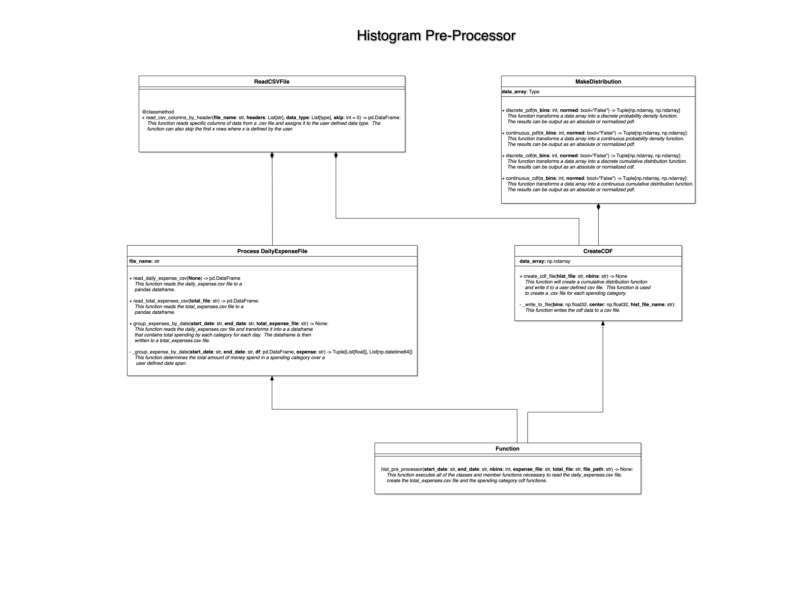
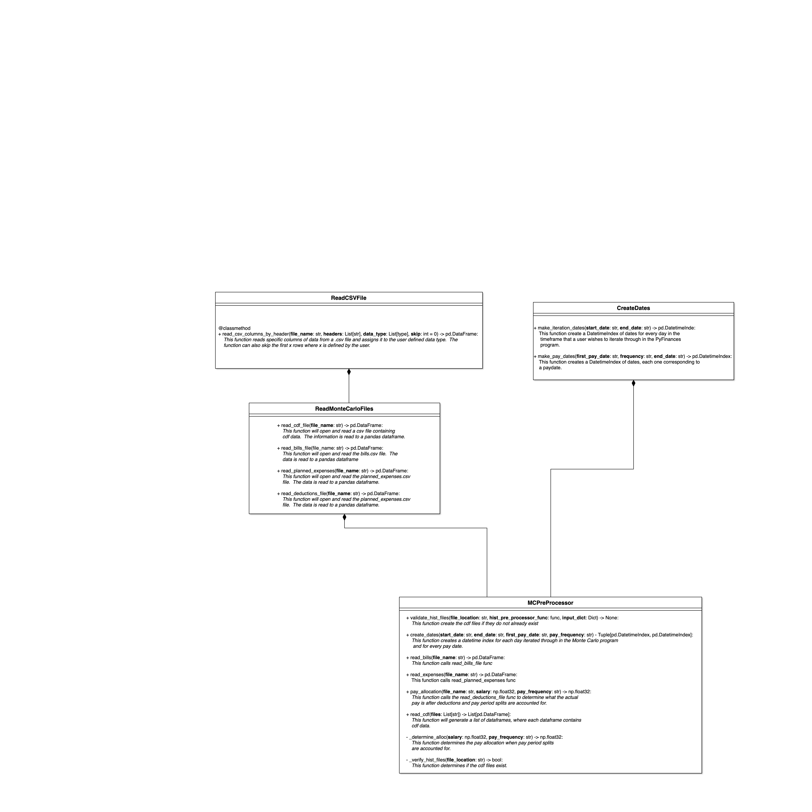

##############
Pre-Processors
##############

These functions and classes are used to pre-process information prior 
to entering the Monte Carlo calculation to estimate the values of the 
checking and savings accounts.  All of the software described in this 
section is maintained in the `pre_processors.py` file. 

ProcessDailyExpenseFile
=======================
The `ProcessDailyExpenseFile` class is encoded with the functionality that
allows it to open and read the `Daily_Expenses.csv` file.  This class
also has the functionality that allows it to transform the contents of
the `Daily_Expenses.csv` file into a day by day accounting of the cumulative
spending for each category, which is written to the `Total_Expenses.csv` file
and placed at the location of the users choice.

.. autoclass:: pre_processor.ProcessDailyExpenseFile
   :members:

MakeDistribution
================

The `MakeDistribution` class acceps a data stream at instantiation.  The class
member functions can transform the data stream into a discrete or cumulative
probability density function and cumulative distribution function.  In each
case the calculated distributions can be normalized.

.. autoclass:: pre_processor.MakeDistribution
   :members:

CreateCDF
=========
The `CreateCDF` class inherits the `MakeDistribution` class to execute its

`Total_Expenses.csv` file, that is transformed into a cdf and then
written to a file.

.. autoclass:: pre_processor.CreateCDF
   :members:

Histogram Pre-Processor
=======================
The `hist_pre_processor` function integrates all necessary functions into 
a histogram pre-processor.  If the user selects **Hist Run** as True, then
the program will initiate this function to create the cdf files.  In addition,
if the users selects False for **Hist Run**, but the cdf files do not exist, 
the software will still run this function.

.. autofunction:: pre_processor.hist_pre_processor

The `hist_pre_processor` function integrates all functions into a component
in the manner shown below.

Read Monte Carlo Files
======================
The `ReadMonteCarloFiles` class contains functions that open and read key csv
files with information necessary to run the PyFinances program.

.. autoclass:: pre_processor.ReadMonteCarloFiles
   :members:

Create Dates
============
The `CreatDates` class allows a user to create a pandas DatetimeIndex with 
a date for every day in the Monte Carlo iteration.  In addition, the class
allows a user to create a date corresponding to every pay date based on 
their pay frequency and the first pay date.

.. autoclass:: pre_processor.CreateDates
   :members:

Monte Carlo Pre-Processors
==========================
The `MCPreProcessor` class integrates all functions that are necessary
to read and process data necessary for the execution of the PyFinances
Monte Carlo iteration.

.. autoclass:: pre_processor.MCPreProcessor
   :members:
 
THe `MCPreProcessor` class integrates all functions into a component in the 
manner shown below

